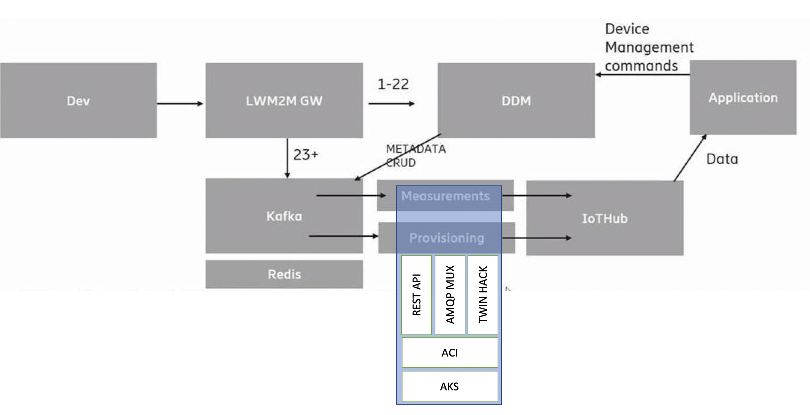

# ddm2iothub

A simple experiment conducted to connect Ericsson's LWM2M system DDM into Azure's IoT Hub

This app consists of 3 microservices. 
1. It has a webserver exposing a simple rest api that is called by the DDM Kafka connector. 
This API allows for simple device management (create and delete devices on IoT Hub), set device state (ONLINE/OFFLINE) and post IPSO LWM2M payloads to IoT Hub as AMQP messages
2. It has an Iot Hub Registry client that sets device tags to the desired status. Note that this should be implemented as reported device properties but this is currently not supported by the Mux GW used.
3. It has a web service that can be used tom query device status.

These componentes were tested running as stand alone Axzure Container Instances and on Azure Kubernetes services.

## Instructions

Enter the IoT Hub Connection string in the data/cs.json files

Provision an Azure Container Instance for the _hubproxy_(tagged latest - needed for all use cases) and _twinhack_ (tagged latest - needed for status management).

